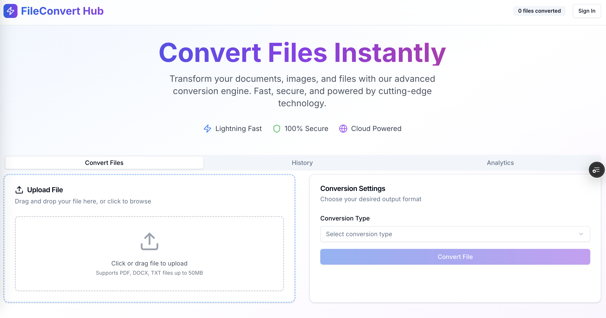

# Change-My-File ✨🗂️⚡

A modern, full-stack file conversion & management app. Upload a file, convert it to the format you need, and download it—fast and secure. Built with a clean Next.js UI, MongoDB for persistence, and optional Stripe billing for premium conversions.

<p align="center">
  <a href="#-features">Features</a> •
  <a href="#-tech-stack">Tech Stack</a> •
  <a href="#-quick-start">Quick Start</a> •
  <a href="#-configuration">Configuration</a> •
  <a href="#-scripts">Scripts</a> •
  <a href="#-api">API</a> •
  <a href="#-testing">Testing</a> •
  <a href="#-deployment">Deployment</a> •
  <a href="#-security--privacy">Security</a> •
  <a href="#-roadmap">Roadmap</a> •
  <a href="#-contributing">Contributing</a> •
  <a href="#-license">License</a>
</p>

---

## 🔥 Features

- 🖼️ **Upload & convert** files with size limits and progress feedback  
- 🔐 **Auth** via Google (NextAuth) with secure session handling  
- 💾 **MongoDB** persistence for jobs, users, and conversion history  
- 💳 **Stripe** integration for paid tiers / webhooks for post-payment provisioning  
- 🚦 **Rate limiting & CORS** ready for multi-origin frontends  
- 📬 **Webhooks** endpoint for Stripe events  
- 🧪 **Test scaffolding** for backend flows  
- 🎛️ **Configurable** limits (max file size, temp & output dirs)

> This README assumes a Next.js app directory setup with Tailwind and a simple API layer for conversions.

---

## 🧰 Tech Stack

- **Next.js** (App Router)  
- **TypeScript / JavaScript**  
- **Tailwind CSS** (with prebuilt UI components)  
- **NextAuth (Google provider)**  
- **MongoDB** (Atlas or local)  
- **Stripe** (payments & webhooks)  

---

## ⚡ Quick Start

### 1) Prerequisites
- Node.js **18+**
- Yarn / pnpm / npm
- MongoDB (local Docker or Atlas)
- Stripe account (if you enable payments)

### 2) Clone & Install
```bash
git clone https://github.com/raimonvibe/change-my-file.git
cd change-my-file
yarn      # or: npm i, pnpm i
```

### 3) Environment Variables
Create a `.env` file in the project root:

```env
# Database
MONGO_URL=mongodb://localhost:27017
DB_NAME=fileconvert_hub

# Public base URL of your deployed frontend
NEXT_PUBLIC_BASE_URL=https://change-my-file.vercel.app/

# Auth (NextAuth + Google)
GOOGLE_CLIENT_ID=your_google_client_id_here
GOOGLE_CLIENT_SECRET=your_google_client_secret_here
NEXTAUTH_SECRET=your_nextauth_secret_here
NEXTAUTH_URL=https://change-my-file.vercel.app/

# Stripe
STRIPE_SECRET_KEY=your_stripe_secret_key_here
NEXT_PUBLIC_STRIPE_PUBLISHABLE_KEY=your_stripe_publishable_key_here
STRIPE_WEBHOOK_SECRET=your_stripe_webhook_secret_here

# File handling
MAX_FILE_SIZE=50000000            # 50MB example
UPLOAD_DIR=/tmp/uploads
CONVERTED_DIR=/tmp/converted

# CORS
CORS_ORIGINS=*
```

> Tip: for local dev set `NEXTAUTH_URL=http://localhost:3000`

### 4) Run MongoDB (local)
**Docker:**
```bash
docker run -d --name local-mongo   -p 27017:27017 -v mongo-data:/data/db mongo:7
```

### 5) Dev server
```bash
yarn dev
# open http://localhost:3000
```

---

## 🔧 Configuration

- **File limits**: tune `MAX_FILE_SIZE` based on your hosting.  
- **Directories**: ensure `UPLOAD_DIR` and `CONVERTED_DIR` exist and are writable in your environment (VPS/Serverless may require temp dirs).  
- **CORS**: set a comma-separated whitelist in `CORS_ORIGINS` for production.  
- **Auth**: create Google OAuth credentials (Authorized redirect URI must include your `/api/auth/callback/google`).  
- **Payments**: after creating products/prices in Stripe, wire them in your UI and verify the webhook secret.

---

## 🗂️ Suggested Project Structure

```txt
.
├─ app/                 # Next.js app routes (pages, API routes)
├─ components/          # UI components
├─ hooks/               # React hooks
├─ lib/                 # server utilities (db, auth, stripe, etc.)
├─ tests/               # test files & fixtures
├─ public/              # static assets (place file.png here too if you prefer)
├─ package.json
└─ .env
```

> Place your banner image as `./file.png` in the repo root (or reference `./public/file.png` and update the path in the Markdown).

---

## 🧭 API

Example routes (adjust to your implementation):

- `POST /api/upload`
  - Body: multipart form with `file`
  - Response: `{ jobId, filename, size, mime }`

- `POST /api/convert`
  - Body: `{ jobId, targetFormat: "pdf" | "png" | "mp3" | ... }`
  - Response: `{ jobId, status: "queued" | "processing" | "done", downloadUrl? }`

- `GET /api/jobs/:jobId`
  - Response: current status & metadata

- `POST /api/webhooks/stripe`
  - Verifies signature using `STRIPE_WEBHOOK_SECRET` and processes events.

**Notes**
- Enforce `MAX_FILE_SIZE` on upload.
- Sanitize filenames & validate MIME types.
- Store minimal metadata in MongoDB (user, job, status, timestamps, result path).

---

## 🧪 Testing

- Unit/integration tests:  
  ```bash
  yarn test
  ```
- For webhook tests, use the Stripe CLI:
  ```bash
  stripe listen --forward-to localhost:3000/api/webhooks/stripe
  stripe trigger payment_intent.succeeded
  ```

---

## 🚀 Deployment

- **Vercel** for the Next.js frontend/API.
- **MongoDB Atlas** for managed database.
- **Stripe**: set env vars in your hosting dashboard and configure webhook endpoint.
- Ensure temp directories exist on the target platform or switch to storage buckets (S3, R2, etc.) for converted files.

---

## 🔐 Security & Privacy

- Validate file types and sizes server-side.  
- Strip EXIF/metadata on image conversions when privacy matters.  
- Never log secrets or full webhook payloads in production.  
- Keep `NEXTAUTH_SECRET` unique and long.  
- Rotate Stripe keys if exposed.

---

## 🗺️ Roadmap

- [ ] Queue worker for heavy conversions (BullMQ / Upstash / Redis)  
- [ ] Chunked uploads & resumable transfers  
- [ ] Storage abstraction (S3/R2/GCS)  
- [ ] Email receipts & conversion notifications  
- [ ] Fine-grained roles/quotas per plan  
- [ ] Accessibility & i18n polish

---

## 🤝 Contributing

PRs welcome!  
1) Fork the repo • 2) Create a feature branch • 3) Commit with conventional messages • 4) Open a PR with context and screenshots.

---

## 📄 License

MIT — see `LICENSE` for details.

---

## 🙌 Acknowledgements

- Next.js, Tailwind, NextAuth  
- Stripe  
- Everyone who files issues & PRs 🧡
